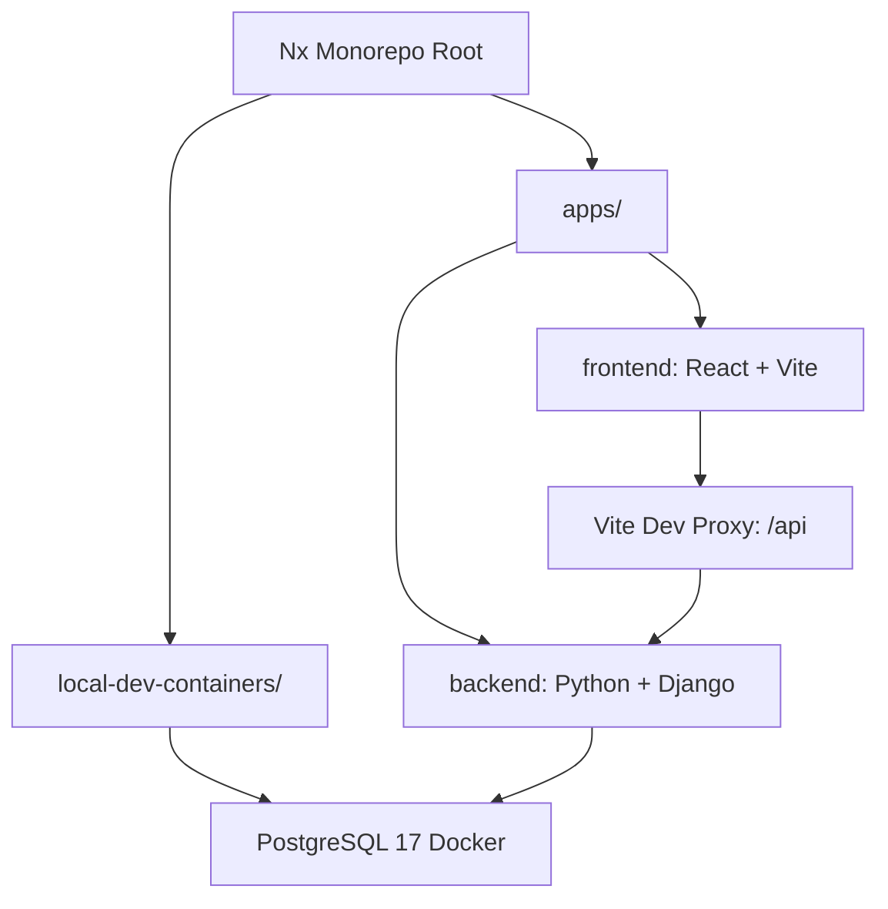

# Pharma Sales Intelligence Platform

This project is a monorepo featuring a **Django** backend and a **React + Vite** frontend, managed and orchestrated by **Nx**.

---

## 1. Architecture Overview



### Why Nx for this stack?
- **Unified Task Orchestration**: Run frontend and backend servers concurrently with a single command (e.g., `npm run dev`).
- **Dependency Graph**: Understand how projects depend on one another.
- **Cache Management**: Cache build, test, and lint tasks locally or remotely.
- **Consistent Tooling**: Maintain standard workspace-wide configurations.

---

## 2. Quickstart Development Guide

Follow these steps to spin up the entire application stack locally.

### Step 1: Clone and Install Dependencies
From the repository root directory, run:
```bash
npm install
```

### Step 2: Set Up Python Virtual Environment
1. Create and activate a virtual environment:
   ```bash
   python3 -m venv .venv
   source .venv/bin/activate
   ```
   *(On Windows, use `.venv\Scripts\activate`)*

2. Install python dependencies:
   ```bash
   pip install -r requirements.txt
   ```

### Step 3: Run the Database Container (PostgreSQL 17)
Spin up the local PostgreSQL database using the NPM script:
```bash
npm run dev:db:run
```
*(Alternatively, run `docker compose up -d` from inside the `local-dev-containers/` folder.)*

To stop the database container, run:
```bash
npm run dev:db:stop
```

*Note: Credentials and connection details are located in the [local-dev-containers/README.md](file:///home/zishan/professional_code/pharma-sales-intelligence-platform/local-dev-containers/README.md).*


### Step 4: Run Database Migrations
Run the initial Django migrations:
```bash
npx nx run backend:migrate
```

### Step 5: Start Both Development Servers
You can boot both the frontend and backend concurrently using the interactive helper script:
```bash
./dev.sh
```
Alternatively, you can run them using NPM scripts:
```bash
npm run dev
# or
npm start
```

Your services will be available at:
- **React Frontend**: [http://localhost:4200/](http://localhost:4200/)
- **Django Backend**: [http://localhost:8000/](http://localhost:8000/)

---

## 3. Monorepo Command Reference

### Starting Services

| Target / Script | Command | Description |
|---|---|---|
| **Concurrently Run All** | `npm run dev` or `./dev.sh` | Launches both frontend and backend development environments simultaneously. |
| **Frontend Only** | `npm run dev:frontend` | Starts the React dev server using Vite. |
| **Backend Only** | `npm run dev:backend` | Starts the Django development server. |
| **Start Database** | `npm run dev:db:run` | Runs the PostgreSQL 17 Docker container. |
| **Stop Database** | `npm run dev:db:stop` | Stops the PostgreSQL 17 Docker container. |

### Django Database Management

| Action | Command |
|---|---|
| **Run Migrations** | `npx nx run backend:migrate` |
| **Create Migrations** | `npx nx run backend:makemigrations` |
| **Open Django Shell** | `npx nx run backend:shell` |
| **Run Django Tests** | `npx nx run backend:test` |

### Frontend Targets

| Action | Command |
|---|---|
| **Build Frontend** | `npx nx build frontend` |
| **Test Frontend (Vitest)** | `npx nx test frontend` |

---

## 4. Configuration Details

### API Proxying (Vite)
To avoid CORS issues and facilitate clean requests in the frontend (e.g. fetching `/api/users`), Vite's dev server is configured to proxy `/api` requests to Django at `http://127.0.0.1:8000`.
This configuration lives in [apps/frontend/vite.config.mts](file:///home/zishan/professional_code/pharma-sales-intelligence-platform/apps/frontend/vite.config.mts).

### Django Settings & CORS
- Django CORS headers are configured using `django-cors-headers`.
- Development settings are located in [apps/backend/backend/settings.py](file:///home/zishan/professional_code/pharma-sales-intelligence-platform/apps/backend/backend/settings.py) and allow access from `http://localhost:4200` and `http://127.0.0.1:4200`.

---

## 5. Production Considerations

When deploying this stack, you have two primary deployment patterns:

### Pattern A: Decoupled Deployments (Recommended)
- **Frontend**: Deploy the static React build (`dist/apps/frontend`) to a CDN or static host (Vercel, Netlify, AWS S3, Cloudflare Pages).
- **Backend**: Deploy the Django container or server to a cloud provider (Render, Fly.io, AWS ECS, Heroku). Configure CORS on Django with the production frontend URL.

### Pattern B: Single Server Deployment (Django serves SPA)
- Configure Vite's build output to write directly to Django's static directory.
- Configure Django to serve the React `index.html` on any non-API fallback paths.
- Use `whitenoise` in Django to serve the static assets efficiently.

---

## 6. General Nx Workspace Info

To learn more about the underlying Nx capabilities:
- Run `npx nx graph` to visually explore the workspace diagram.
- Run `npx nx list` to see all installed plugins.
- Visit [Nx Documentation](https://nx.dev) for guides on task execution, generators, and CI setup.
